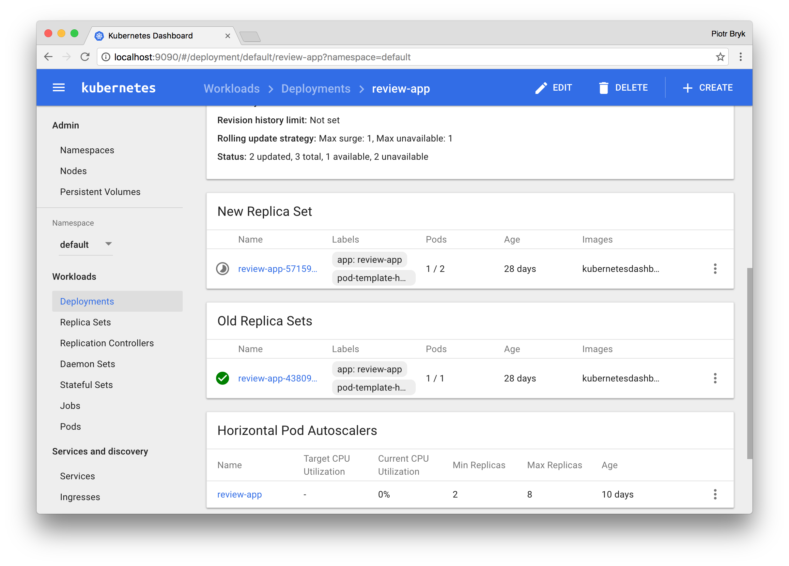
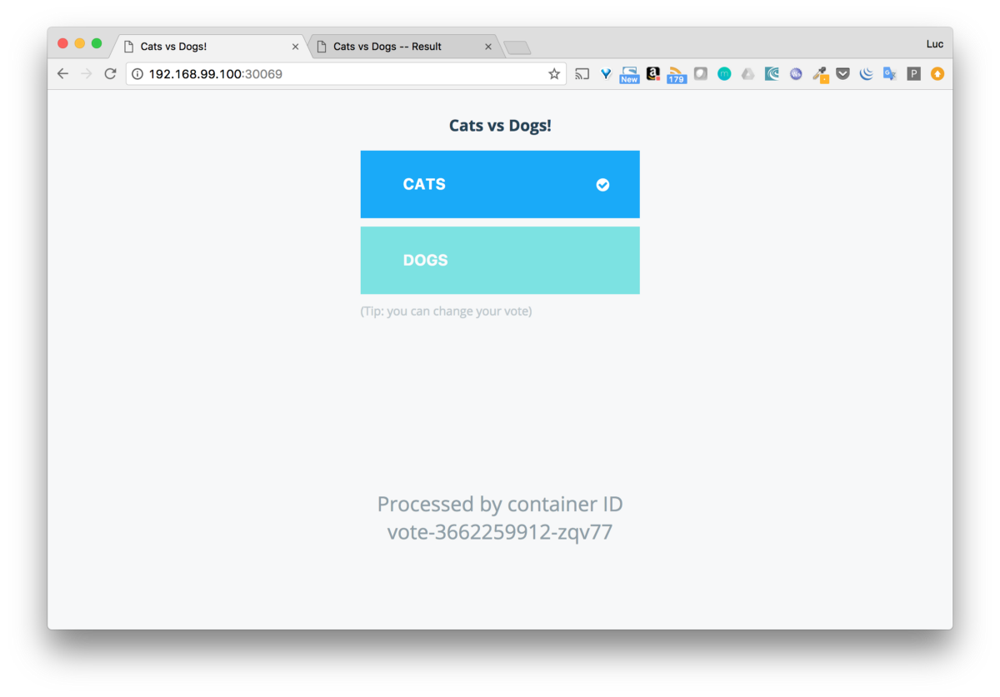
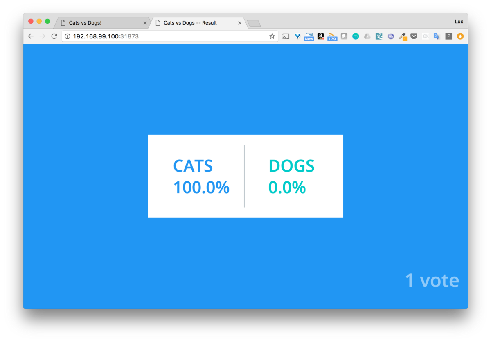

Example Voting App
=========

Getting started
---------------

Download [Docker](https://www.docker.com/products/overview). If you are on Mac or Windows, [Docker Compose](https://docs.docker.com/compose) will be automatically installed. On Linux, make sure you have the latest version of [Compose](https://docs.docker.com/compose/install/). If you're using [Docker for Windows](https://docs.docker.com/docker-for-windows/) on Windows 10 pro or later, you must also [switch to Linux containers](https://docs.docker.com/docker-for-windows/#switch-between-windows-and-linux-containers).

Run the app in Kubernetes
-------------------------

Run the following command to install kubectl:
```
curl -LO https://storage.googleapis.com/kubernetes-release/release/$(curl -s https://storage.googleapis.com/kubernetes-release/release/stable.txt)/bin/darwin/amd64/kubectl
chmod +x ./kubectl
sudo mv ./kubectl /usr/local/bin/kubectl
```

Follow the installation steps on the minikube github page:
```
https://github.com/kubernetes/minikube
```

Start minikube after the installation:
```
$ minikube start
Starting local Kubernetes v1.7.0 cluster…
Starting VM…
Downloading Minikube ISO
 97.80 MB / 97.80 MB [==============================================] 100.00% 0s
Getting VM IP address…
Moving files into cluster…
Setting up certs…
Starting cluster components…
Connecting to cluster…
Setting up kubeconfig…
Kubectl is now configured to use the cluster.
```

Start minikube dashboard:
```
$ minikube dashboard
pening kubernetes dashboard in default browser...
```



Deployment of the application:
```
$ kubectl create -f .
persistentvolumeclaim "db-data" created
deployment "db" created
service "db" created
deployment "redis" created
service "redis" created
deployment "result" created
service "result" created
persistentvolumeclaim "visualizer-claim0" created
deployment "visualizer" created
service "visualizer" created
deployment "vote" created
service "vote" created
deployment "worker" created
service "worker" created
unable to decode "docker-stack-k8s.yml":...
```

The commands below show the services and deployments created.
```
$ kubectl get services
NAME         CLUSTER-IP   EXTERNAL-IP   PORT(S)     AGE
db           None         <none>        55555/TCP   3m
kubernetes   10.0.0.1     <none>        443/TCP     4m
redis        10.0.0.64    <none>        6379/TCP    3m
result       10.0.0.121   <none>        5001/TCP    3m
visualizer   10.0.0.110   <none>        8080/TCP    3m
vote         10.0.0.142   <none>        5000/TCP    3m
worker       None         <none>        55555/TCP   3m
$ kubectl get deployment
NAME         DESIRED   CURRENT   UP-TO-DATE   AVAILABLE   AGE
db           1         1         1            1           3m
redis        1         1         1            1           3m
result       1         1         1            1           3m
visualizer   1         1         1            1           3m
vote         1         1         1            1           3m
worker       1         1         1            1           3m
```

To access the application lookup the ports:
vote is available on port 30069 and result on port 31873. We can now vote and see the result.
```
$ kubectl get svc vote result
NAME      CLUSTER-IP   EXTERNAL-IP   PORT(S)          AGE
vote      10.0.0.215   <nodes>       5000:30069/TCP   15m
result    10.0.0.49    <nodes>       5001:31873/TCP   8m
```




Enable the heapster and metrics-server addon when auto-scaling:
```
minikube start --extra-config kubelet.EnableCustomMetrics=true
minikube addons enable heapster
minikube addons enable metrics-server
```

Change auto-scale for vote app:
```
kubectl autoscale deployment vote --cpu-percent=50 --min=3 --max=10
```

Do a performance monitoring test with Curl to validate that the auto-scaling works as expected:
```
curl -s "http://192.168.99.100:31262/?[1-10000]"
```

Cleaning up
-----

```
kubectl delete --all pods --namespace=default
kubectl delete --all deployments --namespace=default
kubectl delete --all services --namespace=default
```

Architecture
-----


* A Python webapp which lets you vote between two options
* A Redis queue which collects new votes
* A .NET worker which consumes votes and stores them in…
* A Postgres database backed by a Docker volume
* A Node.js webapp which shows the results of the voting in real time

Note
----

The voting application only accepts one vote per client. It does not register votes if a vote has already been submitted from a client.
# dockercatdogs
